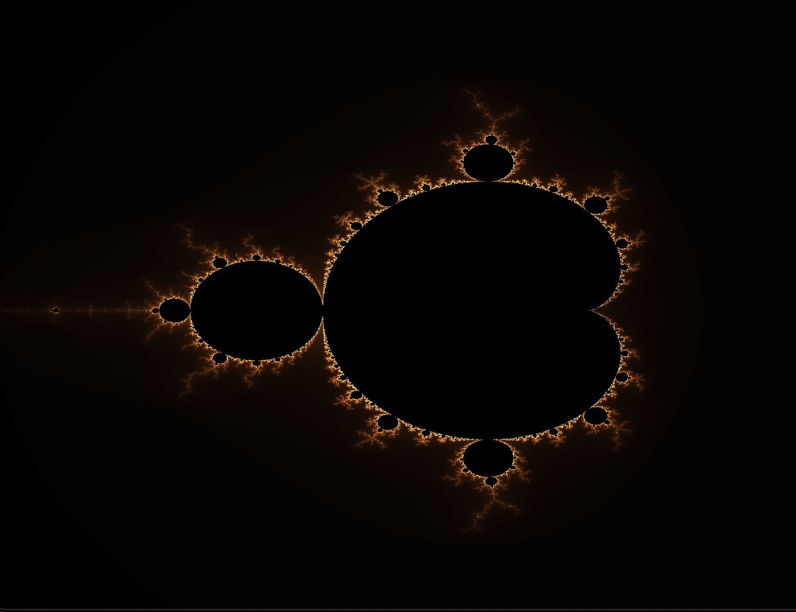
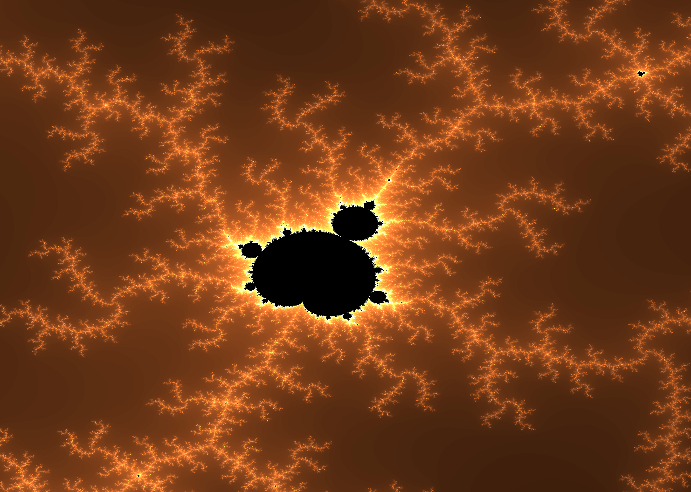
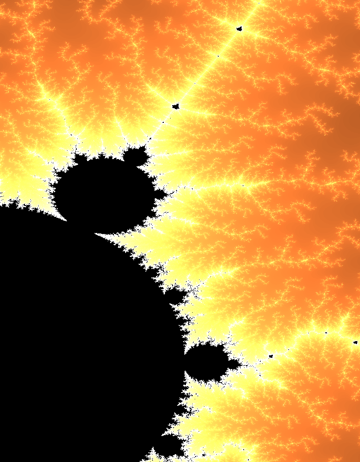
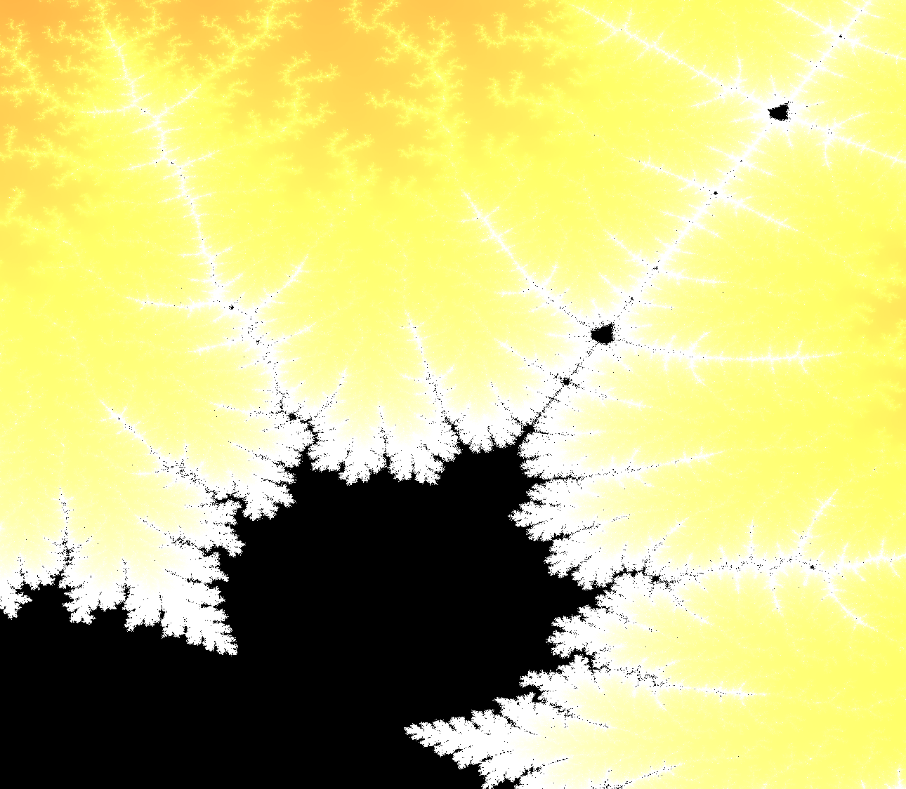
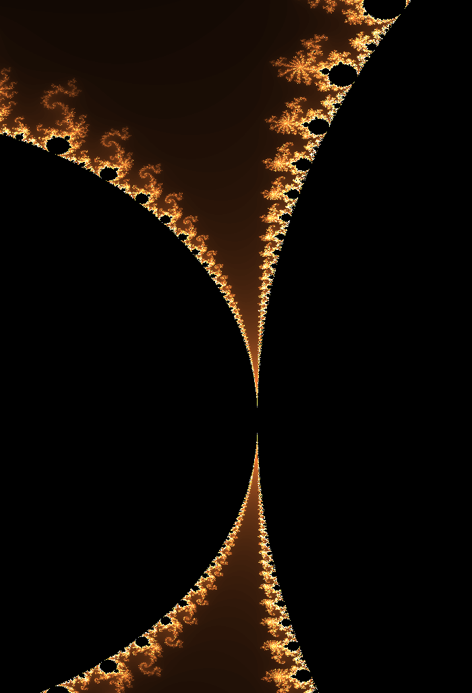
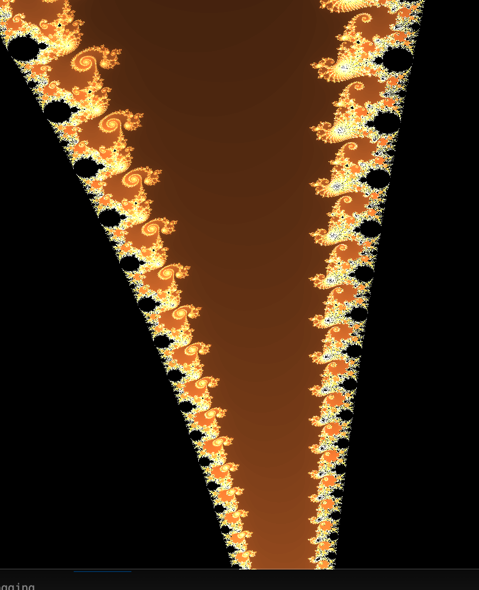
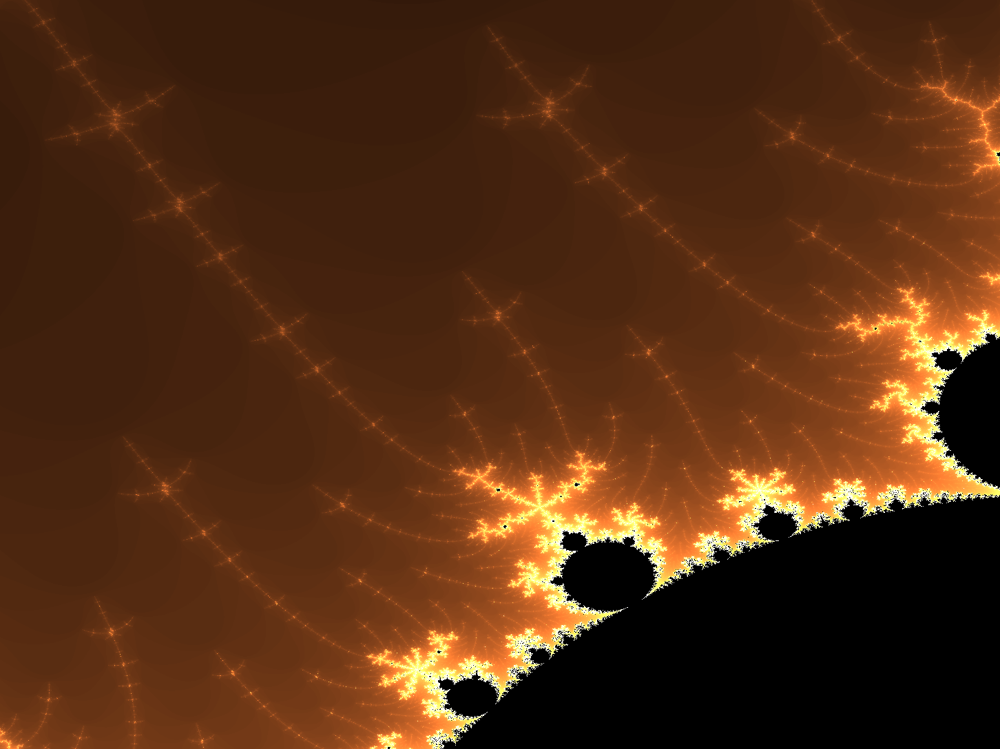
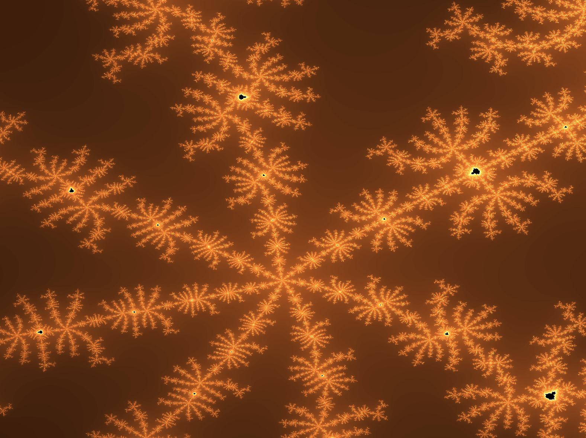

# Mandelbrot set explorer

A rendering of the mandlebrot set using OpenGL, with interactive controls (zoom & pan) using the mouse. 

To run:

```
mkdir build
cd build
cmake ..
make
cd .. 
./build/mandelbrot_set
```

# Image Gallery

<h3>Image Gallery</h3>

<p align="center">
  
  
  <br/>

  
  
  
  <br/>

  
  
  
</p>


<p align="center">
   
  
  
  <br/>

</p>